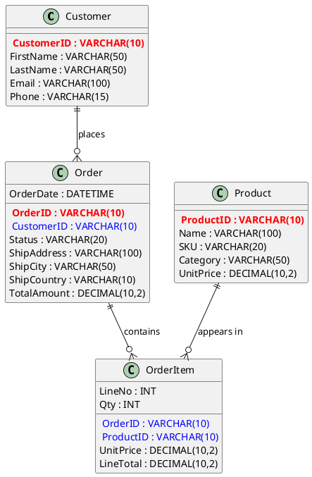

# Lab 1: Intro to NoSQL - From ERD to JSON

## Overview
This lab introduces the fundamental shift from relational database design to NoSQL document modeling. You'll transform a normalized relational schema (represented by an ERD) into MongoDB documents using the **single document approach** - where all related entities are embedded within one comprehensive document structure.

**Key Learning Goal**: Understand how NoSQL databases favor denormalization and embedding over the normalized, table-based approach of relational databases.

## Objective
Convert relational database designs (ERD) into NoSQL document structures by transforming normalized data into **a single embedded MongoDB document per order**. All related entities (Customer, Order, OrderItem, Product) will be consolidated into one document, eliminating the need for joins and foreign key relationships.

## JSON Review

JSON (JavaScript Object Notation) uses key-value pairs to store data:

### Basic Elements:
- **Objects**: Use `{}` to group related data
- **Arrays**: Use `[]` for lists of items  
- **Strings**: Always use double quotes `"text"`
- **Numbers**: No quotes `123` or `45.67`
- **Booleans**: `true` or `false`
- **Null**: `null` for empty values
- **Keys**: Use camelCase `firstName`, `orderDate`

### Example:
```json
{
  "name": "John Doe",
  "age": 25,
  "active": true,
  "skills": ["coding", "design"],
  "address": {
    "street": "123 Main St",
    "city": "Manila"
  }
}
```

## ERD Description

### Entity Relationship Diagram

[erd-diagram](https://cdn-0.plantuml.com/plantuml/png/VP9HQ_em5CNV-odoz-alJDW4NqJ4KYihQjTf7UmnjdSpa2ObkNqGtNTVJ6TmnEunvtTkxhatcMca2fkA1_zA-602I9pcIVvE2awrTcAs99FzT598BjLOGJbrP658A-zv0zCW-AcF6eso0aLE0J7bxfpCoPYyXPleETpyVthi6xfWIcDAAxWX8qjMj0F45MNyrqLMpWvImAqywWTVBjABAbqUUxWRvi-ejcfE4GoPXtcS9-lOo5kasEWRzz2wjmTMXsMfG6ilguKHmwCtcmMo4QYENlzS8kLXTQ6N176KhCELOGz3Rz04eRB3Bhg7NJ41gJHoakQjCrEoR0gyutt5epFk1CDCiGAy4EsTDcPtm6kNwrjqDxMFxwzkkVDs7L64JwdyTNPdDNdSBpsV1mDvQXTbZBsQqm9qBx22eswlnb58WPG9uxbESyz5wngeqeI9NZ03KJOL_mO0)




### Entities and Attributes:

**Customer**
- CustomerID (PK), FirstName, LastName, Email, Phone

**Order** 
- OrderID (PK), CustomerID (FK→Customer), OrderDate, Status, ShipAddress, ShipCity, ShipCountry, TotalAmount

**OrderItem**
- OrderID (FK→Order), LineNo, ProductID (FK→Product), Qty, UnitPrice, LineTotal

**Product**
- ProductID (PK), Name, SKU, Category, UnitPrice

### Relationships:
- Customer 1–M Order
- Order 1–M OrderItem  
- Product 1–M OrderItem

## Target Document Structure

Create a single MongoDB document per order with embedded data:

### Top-level fields:
- `_id` (from OrderID)
- `orderDate` (ISO 8601 with Z)
- `status`, `shipAddress`, `shipCity`, `shipCountry`, `totalAmount`

### Embedded objects:
- `customer`: {customerId, firstName, lastName, email, phone}
- `items`: [{lineNo, productId, name, sku, category, qty, unitPrice, lineTotal}, ...]

**Hint**: Think about nesting related details together and grouping repeated elements in a list.

## Tasks

### 1. Convert Orders to JSON Documents
Transform each order below into the target embedded document structure.

### 2. Insert Documents  
Use `db.lab1.insertOne({...})` for each document.

## Order Data to Convert

### Order 1
```
OrderID: O1001 | CustomerID: C001 | FirstName: Mina | LastName: Lopez | Email: mina@example.com | Phone: 09171234567
OrderDate: 2025-08-10 14:05:00 | Status: PAID | ShipAddress: 12 Oak St | ShipCity: Quezon City | ShipCountry: PH | TotalAmount: 3499.00
Items:
1 | P10 | Mechanical Keyboard | KB-77 | Peripherals | 1 | 1999.00 | 1999.00
2 | P22 | USB-C Hub 6-in-1 | HUB-6 | Accessories | 1 | 999.00 | 999.00  
3 | P22 | USB-C Hub 6-in-1 | HUB-6 | Accessories | 1 | 999.00 | 999.00
```

### Order 2
```
OrderID: O1002 | CustomerID: C002 | FirstName: Paulo | LastName: Reyes | Email: paulo@example.com | Phone: 09181234567
OrderDate: 2025-08-12 09:20:00 | Status: SHIPPED | ShipAddress: 45 Mango Ave | ShipCity: Cebu City | ShipCountry: PH | TotalAmount: 1598.00
Items:
1 | P33 | Wireless Mouse | WM-55 | Peripherals | 2 | 799.00 | 1598.00
```

### Order 3
```
OrderID: O1003 | CustomerID: C003 | FirstName: Aisha | LastName: Santos | Email: aisha@example.com | Phone: 09191234567
OrderDate: 2025-08-15 17:45:00 | Status: PROCESSING | ShipAddress: 89 Pine St | ShipCity: Davao City | ShipCountry: PH | TotalAmount: 4250.00
Items:
1 | P44 | Laptop Stand | LS-88 | Accessories | 1 | 1250.00 | 1250.00
2 | P55 | 24" Monitor | MN-24 | Displays | 1 | 3000.00 | 3000.00
```

### Order 4
```
OrderID: O1004 | CustomerID: C004 | FirstName: Luis | LastName: Villanueva | Email: luis@example.com | Phone: 09201234567
OrderDate: 2025-08-18 11:30:00 | Status: PAID | ShipAddress: 210 Palm Blvd | ShipCity: Manila | ShipCountry: PH | TotalAmount: 4999.00
Items:
1 | P66 | Gaming Chair | GC-99 | Furniture | 1 | 4999.00 | 4999.00
```

## Deliverables

Submit **only**:
- **CSCI112-ST2-[StudentID1]-[LastName1]-[StudentID2]-[LastName2]-ERDtoJSON.js** - A JavaScript file containing the four `db.lab1.insertOne()` commands with your converted JSON documents

**File format example**:
```javascript
// Lab 1 Solution - ERD to JSON Conversion
// Students: [Student1 Name], [Student2 Name]

// Order 1
db.lab1.insertOne({
  // Your JSON document here
});

// Order 2
db.lab1.insertOne({
  // Your JSON document here
});

// Order 3
db.lab1.insertOne({
  // Your JSON document here
});

// Order 4
db.lab1.insertOne({
  // Your JSON document here
});
```

## Grading

**Total: 30 points**

- JSON syntax correctness (10 points)
- Document structure and embedding (10 points) 
- Data accuracy and MongoDB operations (10 points)

## Notes
- Use MongoDB shell only
- Convert dates to ISO 8601 format (YYYY-MM-DDTHH:mm:ssZ)
- Verify totals are mathematically correct
- Test JSON syntax before insertion
