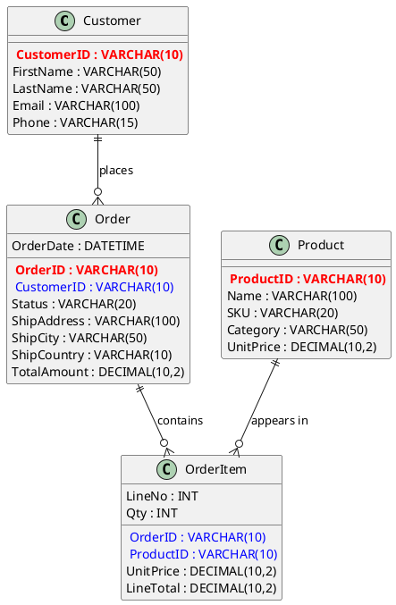

# Lab 1: Intro to NoSQL - From ERD to JSON

## Objective
Convert relational database designs (ERD) into NoSQL document structures by transforming normalized data into **a single embedded MongoDB document per order**. All related entities (Customer, Order, OrderItem, Product) should be consolidated into one document, then inserted with **PyMongo** from your host machine.

## Prerequisites
- Python 3.x with PyMongo installed — see [PyMongo Setup](../notes/04%20-%20MongoDB%20Data%20Structures.md#pymongo-setup) in Notes 04
- Access to a MongoDB server, reachable from your host machine on port 27017
- **Database: `labs`    Collection: `lab1`** — you create the collection; MongoDB makes it on your first insert
- Basic understanding of relational databases, ERDs, and primary/foreign key concepts

## JSON Review

JSON (JavaScript Object Notation) uses key-value pairs to store data:

### Basic Elements:
- **Objects**: Use `{}` to group related data
- **Arrays**: Use `[]` for lists of items  
- **Strings**: Always use double quotes `"text"`
- **Numbers**: No quotes `123` or `45.67`
- **Booleans**: `true` or `false`
- **Null**: `null` for empty values
- **Keys**: Use camelCase `firstName`, `orderDate`

### Example:
```json
{
  "name": "John Doe",
  "age": 25,
  "active": true,
  "skills": ["coding", "design"],
  "address": {
    "street": "123 Main St",
    "city": "Manila"
  }
}
```

### Writing the Same Document in Python

PyMongo does not take JSON text — it takes a **Python dictionary** and converts it to BSON for you.
The shapes are identical; only the literals for booleans and null differ:

| JSON | Python |
|---|---|
| `{ ... }` object | `{ ... }` dict |
| `[ ... ]` array | `[ ... ]` list |
| `"text"` | `"text"` |
| `123`, `45.67` | `123`, `45.67` |
| `true` / `false` | `True` / `False` |
| `null` | `None` |

The example above, as a Python dict:

```python
{
    "name": "John Doe",
    "age": 25,
    "active": True,          # not true
    "skills": ["coding", "design"],
    "address": {
        "street": "123 Main St",
        "city": "Manila"
    }
}
```

Trailing commas are legal in Python and illegal in JSON. Single quotes are legal in Python too,
but stick to double quotes so your documents read the same as the MongoDB documentation.

## ERD Description

### Entity Relationship Diagram



```plantuml
@startuml
!define ENTITY class
!define PK <b><color:red>
!define FK <color:blue>

ENTITY Customer {
  PK CustomerID : VARCHAR(10)
  FirstName : VARCHAR(50)
  LastName : VARCHAR(50)
  Email : VARCHAR(100)
  Phone : VARCHAR(15)
}

ENTITY Order {
  PK OrderID : VARCHAR(10)
  FK CustomerID : VARCHAR(10)
  OrderDate : DATETIME
  Status : VARCHAR(20)
  ShipAddress : VARCHAR(100)
  ShipCity : VARCHAR(50)
  ShipCountry : VARCHAR(10)
  TotalAmount : DECIMAL(10,2)
}

ENTITY OrderItem {
  FK OrderID : VARCHAR(10)
  LineNo : INT
  FK ProductID : VARCHAR(10)
  Qty : INT
  UnitPrice : DECIMAL(10,2)
  LineTotal : DECIMAL(10,2)
}

ENTITY Product {
  PK ProductID : VARCHAR(10)
  Name : VARCHAR(100)
  SKU : VARCHAR(20)
  Category : VARCHAR(50)
  UnitPrice : DECIMAL(10,2)
}

Customer ||--o{ Order : "places"
Order ||--o{ OrderItem : "contains"
Product ||--o{ OrderItem : "appears in"

@enduml
```


### Entities and Attributes:

**Customer**
- CustomerID (PK), FirstName, LastName, Email, Phone

**Order** 
- OrderID (PK), CustomerID (FK→Customer), OrderDate, Status, ShipAddress, ShipCity, ShipCountry, TotalAmount

**OrderItem**
- OrderID (FK→Order), LineNo, ProductID (FK→Product), Qty, UnitPrice, LineTotal

**Product**
- ProductID (PK), Name, SKU, Category, UnitPrice

### Relationships:
- Customer 1–M Order
- Order 1–M OrderItem  
- Product 1–M OrderItem

## Target Document Structure

Create a single MongoDB document per order with embedded data:

### Top-level fields:
- `_id` (from OrderID)
- `orderDate` (ISO 8601 with Z)
- `status`, `shipAddress`, `shipCity`, `shipCountry`, `totalAmount`

### Embedded objects:
- `customer`: customerId, firstName, lastName, email, phone
- `items`: [lineNo, productId, name, sku, category, qty, unitPrice, lineTotal, ...]

**Hint**: Think about nesting related details together and grouping repeated elements in a list.

## Tasks

### 1. Convert Orders to Documents
Transform each order below into the target embedded document structure, written as a Python dict.

### 2. Insert the Documents

Work in **database `labs`, collection `lab1`**. Start your script with this preamble — it is the
only place the database and collection are named, so everything after it is unambiguous:

```python
from pymongo import MongoClient

VM_IP_ADDRESS = "<IP_ADDRESS>"   # replace with your VM's IP address

client = MongoClient(f"mongodb://{VM_IP_ADDRESS}:27017/")

# Database: labs    Collection: lab1
lab1 = client["labs"]["lab1"]
```

Then insert one document per order with `lab1.insert_one({...})`.

Because each order sets its own `_id` (from `OrderID`), re-running your script raises
`DuplicateKeyError`. Clear the collection first so the script is safe to run repeatedly:

```python
# Only removes lab1 — the restored labs collections are untouched
lab1.delete_many({})
```

### 3. Verify Your Inserts

End your script with a check, so you can see what actually landed in the database:

```python
print("documents inserted:", lab1.count_documents({}))

for doc in lab1.find().sort("_id", 1):
    print(doc["_id"], doc["customer"]["firstName"], len(doc["items"]), "item(s)")
```

Expected output:

```
documents inserted: 4
O1001 Mina 3 item(s)
O1002 Paulo 1 item(s)
O1003 Aisha 2 item(s)
O1004 Luis 1 item(s)
```

## Order Data to Convert

### Order 1
```
OrderID: O1001 | CustomerID: C001 | FirstName: Mina | LastName: Lopez | Email: mina@example.com | Phone: 09171234567
OrderDate: 2025-08-10 14:05:00 | Status: PAID | ShipAddress: 12 Oak St | ShipCity: Quezon City | ShipCountry: PH | TotalAmount: 3499.00
Items:
1 | P10 | Mechanical Keyboard | KB-77 | Peripherals | 1 | 1999.00 | 1999.00
2 | P22 | USB-C Hub 6-in-1 | HUB-6 | Accessories | 1 | 999.00 | 999.00  
3 | P22 | USB-C Hub 6-in-1 | HUB-6 | Accessories | 1 | 999.00 | 999.00
```

### Order 2
```
OrderID: O1002 | CustomerID: C002 | FirstName: Paulo | LastName: Reyes | Email: paulo@example.com | Phone: 09181234567
OrderDate: 2025-08-12 09:20:00 | Status: SHIPPED | ShipAddress: 45 Mango Ave | ShipCity: Cebu City | ShipCountry: PH | TotalAmount: 1598.00
Items:
1 | P33 | Wireless Mouse | WM-55 | Peripherals | 2 | 799.00 | 1598.00
```

### Order 3
```
OrderID: O1003 | CustomerID: C003 | FirstName: Aisha | LastName: Santos | Email: aisha@example.com | Phone: 09191234567
OrderDate: 2025-08-15 17:45:00 | Status: PROCESSING | ShipAddress: 89 Pine St | ShipCity: Davao City | ShipCountry: PH | TotalAmount: 4250.00
Items:
1 | P44 | Laptop Stand | LS-88 | Accessories | 1 | 1250.00 | 1250.00
2 | P55 | 24" Monitor | MN-24 | Displays | 1 | 3000.00 | 3000.00
```

### Order 4
```
OrderID: O1004 | CustomerID: C004 | FirstName: Luis | LastName: Villanueva | Email: luis@example.com | Phone: 09201234567
OrderDate: 2025-08-18 11:30:00 | Status: PAID | ShipAddress: 210 Palm Blvd | ShipCity: Manila | ShipCountry: PH | TotalAmount: 4999.00
Items:
1 | P66 | Gaming Chair | GC-99 | Furniture | 1 | 4999.00 | 4999.00
```

## Deliverables

Submit **only** one `.zip` file, named exactly:

**CSCI112-[StudentID]-[LastName]-ERDtoJSON.zip** — e.g. `CSCI112-181234-Cruz-ERDtoJSON.zip`

The zip must contain your Python source — the four `lab1.insert_one()` calls with your converted
documents — and a `requirements.txt`:

```
CSCI112-181234-Cruz-ERDtoJSON.zip
├── erd_to_json.py
└── requirements.txt
```

**Do not include a virtual environment or installed dependencies** — no `.venv/`, no
`site-packages/`, no wheels. Graders build a fresh environment from your `requirements.txt`.

Generate it from your activated virtual environment:

```bash
pip freeze > requirements.txt
```

For this lab that is two lines (your versions may differ):

```
dnspython==2.8.0
pymongo==4.17.0
```

**Python file format example**:
```python
"""
Certificate of Authorship:
I have not discussed the Python language code in my program with anyone
other than my instructor or the teaching assistants assigned to this course.
I have not used Python language code obtained from another student,
or any other unauthorized source, either modified or unmodified.
If any Python language code or documentation used in my program
was obtained from another source, such as a textbook or course notes,
that has been clearly noted with a proper citation in the comments of my program.
"""

# Lab 1 Solution - ERD to Document Conversion
# Student: [Your Name]

from pymongo import MongoClient

VM_IP_ADDRESS = "<IP_ADDRESS>"   # replace with your VM's IP address

client = MongoClient(f"mongodb://{VM_IP_ADDRESS}:27017/")

# Database: labs    Collection: lab1
lab1 = client["labs"]["lab1"]

# Start clean so this script can be re-run
lab1.delete_many({})

# Order 1
lab1.insert_one({
    # Your document here
})

# Order 2
lab1.insert_one({
    # Your document here
})

# Order 3
lab1.insert_one({
    # Your document here
})

# Order 4
lab1.insert_one({
    # Your document here
})

# Verification
print("documents inserted:", lab1.count_documents({}))
for doc in lab1.find().sort("_id", 1):
    print(doc["_id"], doc["customer"]["firstName"], len(doc["items"]), "item(s)")
```

## Grading

**Total: 30 points**

- Document syntax correctness — valid Python dicts, correct types (10 points)
- Document structure and embedding (10 points) 
- Data accuracy and PyMongo operations (10 points)

## Notes
- Use PyMongo from your host machine, not `mongosh`
- Convert dates to ISO 8601 format (`"2025-08-10T14:05:00Z"`) as shown in the order data
- Run your script and confirm the verification output before submitting

### A Note on Date Types

This lab stores dates as ISO 8601 **strings**, which keeps the documents readable and sortable.
Production code usually stores a real BSON date instead — pass a `datetime` and PyMongo converts
it for you:

```python
from datetime import datetime, timezone

order = {
    # Stored as a BSON date, not a string
    "orderDate": datetime(2025, 8, 10, 14, 5, tzinfo=timezone.utc),
    # ... the rest of your order fields
}
```

You will use BSON dates in later modules. **For this lab, submit the strings.**
